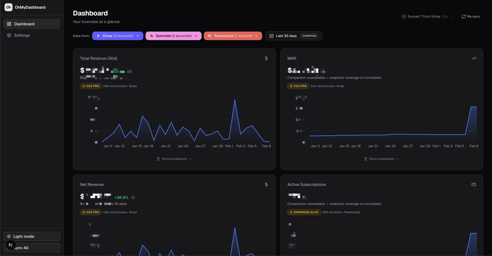

# OhMyDashboard

The daily cockpit for indie hackers, builders, and founders.

Connect the tools you already use (Stripe, Gumroad, RevenueCat today; more
coming) and see a single, clean dashboard for revenue, customers, and product
performance across all your businesses.

OhMyDashboard is open source and runs locally. Your data stays on your machine.



## Why this exists

If you are an indie builder, you are constantly switching tabs:

- Stripe for subscriptions (and multiple accounts)
- Gumroad for legacy products
- RevenueCat for mobile apps
- App Store Connect, Mixpanel, Facebook Ads (soon)

OhMyDashboard gives you one place to check every day, with filters for accounts,
projects, and time ranges. It is built to be flexible without feeling complex.

## Getting Started

### Option A: one‑line install (CLI)

```bash
npx ohmydashboard
```

This will:
- clone the repo into `./ohmydashboard`
- install dependencies
- print the next steps to run the app

Requirements: `git` and `pnpm`.

### Option B: manual install

```bash
git clone <repo-url>
cd ohmydashboard
pnpm install
```

### 2) Run the app

```bash
pnpm dev
```

Open [http://localhost:3000](http://localhost:3000).

### 3) Connect your accounts

Go to [http://localhost:3000/settings](http://localhost:3000/settings) and
add your integrations (Stripe, Gumroad, RevenueCat). Credentials are stored
locally, never sent to any external server.

## What you get

- One dashboard for all products and accounts
- Revenue and sales trends by day
- Source leaderboards and product groupings
- Customers by country (paying vs all)
- Local-first storage (SQLite)

## Architecture goals

- Simple to add integrations
- Supports multiple accounts per integration
- Supports projects per account and blended rollups
- Clear metric standards for accurate aggregation
- Test-driven development for safe iteration

## Local storage

OhMyDashboard stores data in a local SQLite database at:

```
.ohmydashboard/data.db
```

You can delete this file at any time to reset the app.

## Integrations

Current integrations:

- Stripe
- Gumroad
- RevenueCat

Planned integrations include App Store Connect, Mixpanel, X, and Facebook Ads.

## Contributing

We care about tests. If you add or change behavior, add tests.

Quick check:

```bash
pnpm test
```

## Scripts

```bash
pnpm dev
pnpm build
pnpm start
pnpm lint
pnpm test
```
